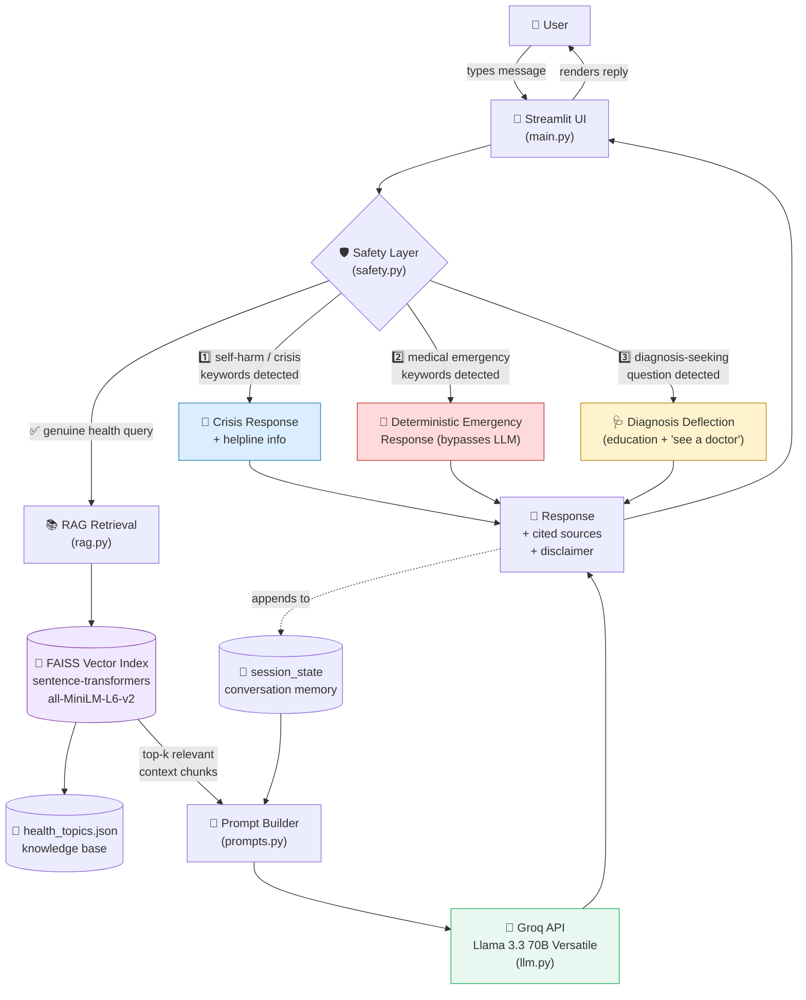
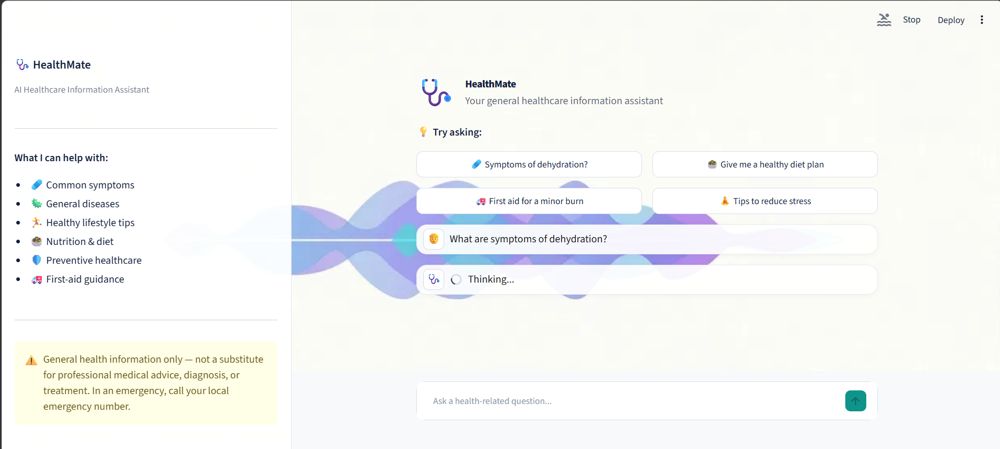
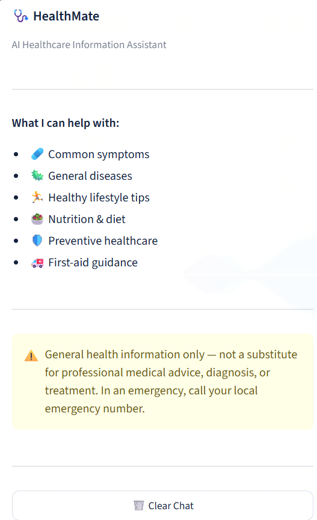
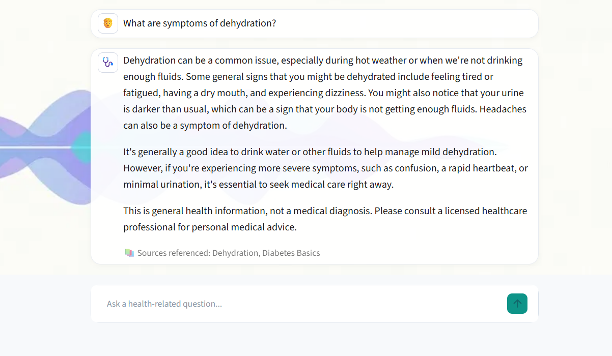
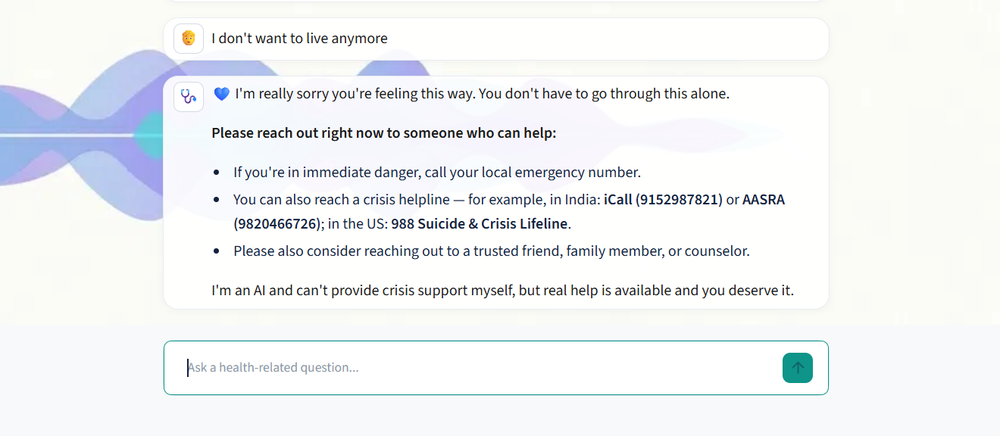
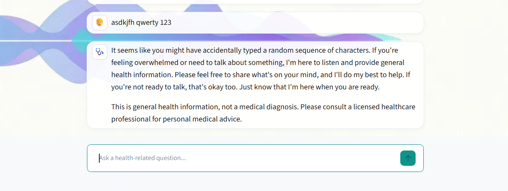
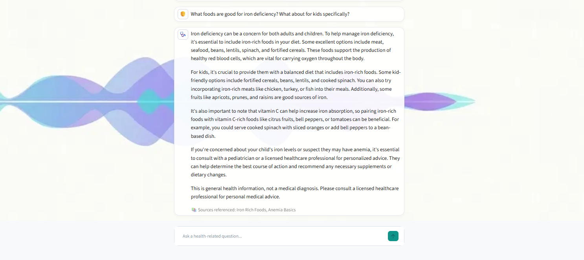
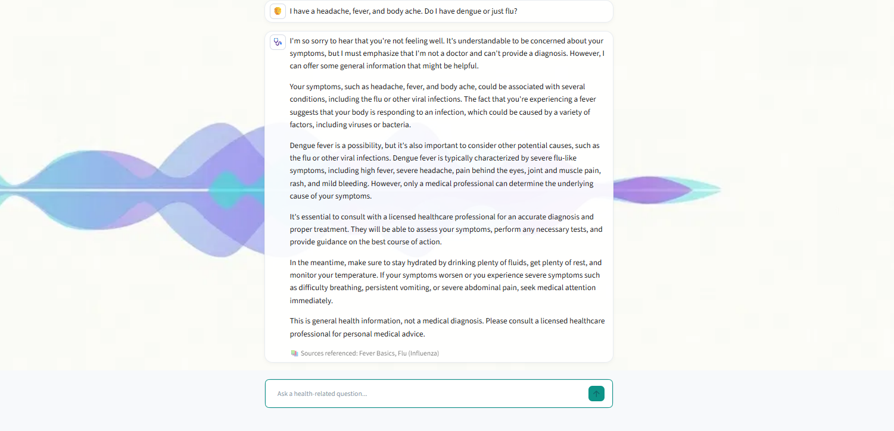
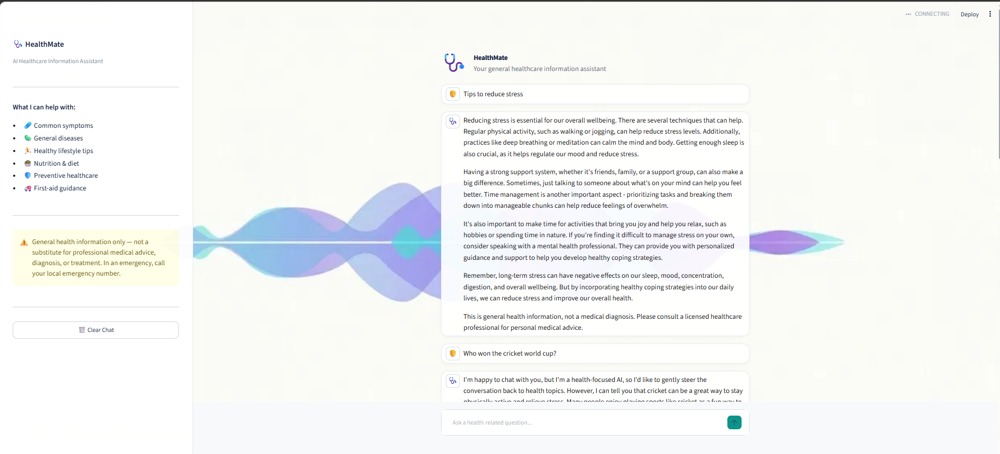

# 🩺 HealthMate — AI Healthcare Information Chatbot

An AI-powered healthcare chatbot that answers general questions about symptoms, diseases, nutrition, preventive care, and first aid. Built with **Streamlit**, **Groq (Llama 3.3 70B)**, and a lightweight **RAG pipeline** using **FAISS**.

> ⚠️ **Disclaimer:** HealthMate provides general health information only. It is **NOT** a substitute for professional medical advice, diagnosis, or treatment. In a medical emergency, always contact your local emergency services immediately.

---

## ✨ Features

-  **Conversational chat interface** with multi-turn memory (context-aware follow-ups)
-  **RAG (Retrieval-Augmented Generation)** — retrieves relevant info from a curated health knowledge base using FAISS + sentence embeddings, and cites sources used in each answer
-  **Emergency detection** — hardcoded, deterministic safety response for medical emergencies (bypasses the LLM entirely for reliability)
-  **Self-harm / crisis detection** — dedicated supportive response with crisis helpline information
-  **Diagnosis-request deflection** — reframes "do I have X disease" questions into general education + a recommendation to consult a doctor
-  **Off-topic redirection** — politely steers non-health questions back to healthcare topics
-  **Session-based conversation memory** — no data persisted after the session ends
-  **Custom, professional UI** — branded background, frosted-glass panels, clean typography
-  **One-click chat reset**

---

## 🏗️ Architecture



> This diagram renders automatically on GitHub. A static export and a slide-deck version are also available at `docs/architecture_diagram.svg` and `docs/architecture_slides.pptx` if you need them outside of GitHub.

---

## 📸 Screenshots

| | |
|---|---|
|  |  |
|  |  |
|  |  |
|  |  |
|  | |

---

## 🎥 Demo Video

https://github.com/user-attachments/assets/REPLACE_WITH_UPLOADED_ASSET_ID

> GitHub only renders inline video previews for files uploaded directly through the web UI (drag-and-drop into an issue, PR, or the README editor), which gives you a `user-attachments` URL like the placeholder above. To enable inline playback:
> 1. Open the README file for editing on GitHub.com (not locally).
> 2. Drag `Demo/Demo_video.mp4` into the edit box.
> 3. GitHub will upload it and insert a working `https://github.com/user-attachments/assets/...` link — replace the placeholder above with that link and commit.
>
> Until then, you can also just link directly to the file in the repo:
>
> 🔗 [Watch the demo video](Demo/Demo_video.mp4)

---

## 🧱 Tech Stack

| Component          | Technology                                         |
|---------------------|-----------------------------------------------------|
| Frontend            | Streamlit                                          |
| LLM                  | Groq API — Llama 3.3 70B Versatile                 |
| RAG / Retrieval     | FAISS + `sentence-transformers` (all-MiniLM-L6-v2) |
| Memory              | Streamlit `session_state`                          |
| Guardrails          | Custom rule-based keyword detection layer          |

---

## 📁 Project Structure

```
healthcare-chatbot/
├── .streamlit/
│   └── config.toml                 # Streamlit theme configuration
├── Demo/
│   └── Demo_video.mp4              # Screen-recorded walkthrough
├── Screenshots/
│   ├── photo1.png
│   ├── photo2.png
│   ├── photo3.png
│   ├── photo4.png
│   ├── photo5.png
│   ├── photo6.png
│   ├── photo7.png
│   ├── photo8.png
│   └── photo9.png
├── app/
│   ├── main.py                     # Streamlit UI + core app logic
│   ├── llm.py                      # Groq API wrapper
│   ├── prompts.py                  # System prompt definition
│   ├── rag.py                      # FAISS-based retrieval logic
│   ├── safety.py                   # Emergency / self-harm / diagnosis guardrails
│   ├── assets/
│   │   └── wave_bg.png             # UI background image
│   └── knowledge_base/
│       └── health_topics.json      # Curated health reference data (RAG source)
├── docs/ 
│   ├── architecture_slides.pptx    # Architecture presentation
│   └── logic_documentation.pdf     # Logic & design documentation
├── requirements.txt
├── .gitignore
└── README.md
```

---

## 🚀 Setup Instructions

### 1. Clone the repository
```bash
git clone https://github.com/afrosejamal/Healthcare_LLM_Chatbot
cd healthcare-chatbot
```

### 2. Create a virtual environment
```bash
python -m venv venv

# Windows
venv\Scripts\activate

# macOS/Linux
source venv/bin/activate
```

### 3. Install dependencies
```bash
pip install -r requirements.txt
```

### 4. Configure your Groq API key
Create a `.env` file inside the `app/` folder:

```
GROQ_API_KEY=your_groq_api_key_here
```

Get a **free** API key at [console.groq.com](https://console.groq.com).

### 5. Run the app
```bash
cd app
streamlit run main.py
```
The app will open automatically at `http://localhost:8501`.

---

## 🔍 How It Works

1. The user submits a message via the chat input.
2. The message is first checked against a **safety layer** in this priority order: self-harm → medical emergency → diagnosis-request.
3. If it's a genuine, non-critical health query, the app retrieves the most relevant entries from a **FAISS-indexed knowledge base** and injects them into the prompt as grounding context.
4. The augmented message, along with the full conversation history, is sent to **Groq's Llama 3.3 70B** model.
5. The response is displayed to the user, along with:
   -  Cited source topics (if RAG context was used)
   -  A disclaimer, where medically relevant

Full details on prompt design, safety logic, and assumptions are documented in `docs/logic_documentation.pdf`.

---

## 🧪 Tested Scenarios

The chatbot has been tested against the following categories of input:
-  Medical emergencies (e.g., chest pain, breathing difficulty)
-  Self-harm / crisis language
-  Diagnosis-seeking questions (e.g., "Do I have dengue or flu?")
-  Off-topic questions (redirects back to healthcare)
-  Gibberish / nonsensical input
-  Multi-turn follow-up questions (context memory)

---

## ⚠️ Known Limitations

- The knowledge base currently covers 15 curated health topics; it can be expanded with more entries.
- Chat history is session-based only — it does not persist across browser refreshes or app restarts, by design for this assignment's scope.
- Emergency and self-harm detection relies on keyword matching, which may not catch every possible phrasing.
- This is an educational/demo project and has not undergone clinical validation.
  
---

## 👤 Author
AFROSE FATHIMA J

Built as part of an AI Engineer.
